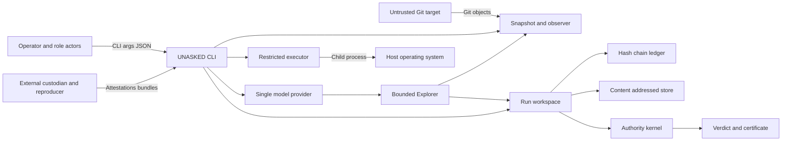

# UNASKED repository threat model

## Executive summary

UNASKED is a local CLI that converts untrusted Git repository content, bounded Explorer
actions, and operator-supplied experiment/replay records into integrity-sensitive evidence
bundles. Its highest risks are host compromise through an allowlisted interpreter or local
model-provider executable, repository/context exfiltration by a provider that can still use
the network, fabricated external custody/replay attestations, unauthenticated actor-role
claims, and rollback or deletion by a local user who controls the evidence workspace. The
current local executor and JSON-subprocess provider are deliberately treated as recorders and
policy reducers, not security sandboxes. External replay receipts are structurally bound to
their replay subject and retained as evidence, but v0.3.0 has no independently configured
signature trust root. The authority kernel therefore treats every imported receipt as
unauthenticated and refuses to use it to authorize `VERIFIED`.

## Scope and assumptions

In scope: `src/unasked/`, the CLI and installed command, run workspaces created by the CLI,
the schemas and frozen P0 protocol, local Git targets, and imported external replay/custody
records. Build/test tooling and public fixtures are considered separately from runtime.

Out of scope: implementation of the private benchmark store, a container/VM isolation
backend, the internals of an operator-selected model provider, a web service or UI, remote
multi-user deployment, and the security of the host operating system or Git executable.

Assumptions, retained because the user requested autonomous progress without questions:

- The intended deployment is a single-user local CLI with no listening network service.
- Target repositories and their bytes may be malicious; operators and external evidence
  providers may make mistakes or attempt to inflate a claim.
- The host user can edit or delete workspace files; v0.1 detects many mutations but does not
  provide durable off-host retention or rollback prevention.
- Actor IDs and roles are declarations, not authenticated principals.
- External benchmark custody and isolated replay receipts are organizational controls whose
  issuer authenticity is not cryptographically verified; imported receipts cannot authorize
  `VERIFIED` in v0.3.0.
- No runtime secrets are required. An allowlisted experiment or provider child process may
  still read host files or use the network unless an external OS/container boundary prevents
  it; the provider bridge's reduced environment is not a confidentiality boundary.

Open questions that would materially change risk: whether future runs are multi-user, which
container/VM backend will enforce isolation, how authority and custodian identities will be
authenticated, and whether ledger checkpoints will be signed or stored off-host.

## System model

### Primary components

- CLI/parser and JSON envelope: command dispatch, bounded raw reads, and stable error
  handling (`src/unasked/cli.py`, `_command_parser`, `main`).
- Run workspace: immutable target/protocol/context records plus append-only collections and a
  rebuildable SQLite index (`src/unasked/project.py`, `Project`).
- Integrity stores: canonical hash-chain JSONL ledger and SHA-256 content-addressed store
  (`src/unasked/ledger.py`, `EventLedger`; `src/unasked/artifacts.py`, `ArtifactStore`).
- Repository plane: fixed commit resolution, Git-object snapshotting, temporary worktrees,
  and deterministic fact extraction (`src/unasked/repository.py`, `capture_snapshot`;
  `src/unasked/observer.py`, `observe_repository`).
- Execution plane: argv-only allowlist, trusted absolute-PATH resolution, cwd confinement,
  timeout, and reduced environment; model-authored Git commands are rejected and the one Git
  diff command is authority-controlled. This is explicitly not a network/filesystem sandbox
  (`src/unasked/sandbox.py`, `RestrictedExecutor`; `src/unasked/workflow.py`).
- Explorer plane: finite budget accounting, immutable-snapshot tools, one strict JSON action
  per turn, raw request/response CAS capture, and either a scripted development provider or
  one local JSON-subprocess provider (`src/unasked/budget.py`, `BudgetMeter`;
  `src/unasked/explorer.py`, `BoundedExplorer`; `src/unasked/providers.py`).
- Trial plane: benchmark-neutral deterministic signals plus five-arm aggregate metrics;
  unsealed inputs remain non-certifying (`src/unasked/baseline.py`;
  `src/unasked/trials.py`).
- Evidence workflow and authority: plan/execute/review/replay orchestration and deterministic
  authorization gates (`src/unasked/workflow.py`, `InvestigationService`;
  `src/unasked/authority.py`, `AuthorityKernel`).
- Data contracts and frozen policy (`src/unasked/schema_defs/`, `src/unasked/schemas.py`,
  `src/unasked/protocol.py`, `constitution/`).

### Data flows and trust boundaries

- Operator or role actor → CLI: arguments and JSON files cross a local process boundary.
  `argparse`, JSON decoding, enums, schemas, path confinement, and capability checks validate
  them; actor identity itself is not authenticated.
- Untrusted Git target → snapshot/observer: commit IDs, trees, paths, documentation, CI, and
  source bytes cross through Git subprocess output. Observation reads use Git objects rather
  than mutable checkout bytes and attach SHA-256 plus commit/tree binding. Git replace refs
  and ambient `GIT_*` overrides are disabled. Clean checks copy the source index into fresh
  isolated metadata, so repository filter commands are never loaded. Replay/experiment
  checkouts use a new repository that borrows objects only during authority-controlled
  materialization, repacks them locally, and removes the alternate before observation or
  experiment code; source hooks, filters, and local Git configuration are never loaded.
- Frozen plan → executor → host OS: argv, cwd, environment, and time limits cross into a child
  process. Shell invocation is disabled and secrets named in the environment are stripped,
  but an interpreter retains normal host filesystem and network powers.
- CLI → provider subprocess → Explorer: bounded canonical JSON containing snapshot inventory,
  observations, prior tool results, and budget state crosses stdio. Combined stdout/stderr is
  capped, invocation timeout is limited by the remaining aggregate wall budget, declared
  provider files are hash-bound, raw bytes are retained in CAS, and stdout is parsed as exactly
  one action-whitelisted JSON object. Ordinary descendants are terminated through a Windows
  Job Object or POSIX process group on every exit path. The child can nevertheless read host
  files, contact a network, or deliberately evade a POSIX process group under the operator's
  OS account.
- Explorer → immutable snapshot tools/workflow: literal file reads/searches consume Git-object
  bytes, while accepted proposals pass through the existing expectation/candidate/plan APIs.
  No Explorer action exposes challenge, replay, verdict, certificate, or publish authority.
- Executor/observer → workspace: stdout, stderr, facts, hashes, and state events enter JSONL
  and CAS. SHA-256, canonical encoding, sequence chaining, and write-once APIs protect
  integrity but not deletion or old-snapshot rollback by the host user.
- External custodian/reproducer → import commands: manifest hashes, attestations, replay JSON,
  environment claims, and artifact references enter from outside. Schemas, CAS hashes, and
  replay-receipt subject bindings are checked; signer identity and actual isolation are not
  authenticated, so the receipt cannot satisfy the authorization gate.
- Evidence workspace → authority kernel → certificate: references and state history cross an
  authority boundary. Every deterministic gate must pass, proposer/authority IDs must differ,
  and the certificate is written before the `VERIFIED` state transition.

#### Diagram

## Assets and security objectives

| Asset | Why it matters | Security objective (C/I/A) |
|---|---|---|
| Frozen constitution and protocol | Defines what evidence is allowed to mean | I, A |
| Target commit and snapshot binding | Prevents analysis from drifting to different bytes | I, A |
| Event ledger and raw command history | Detects claim laundering and cherry-picking | I, A |
| CAS evidence bytes and hashes | Grounds claims in replayable artifacts | I, A |
| Hidden benchmark and ground truth | Leakage destroys the meaning of blind evaluation | C, I |
| Context and blindness manifests | Establish whether a result was actually unasked | I |
| Actor/role separation and custody attestations | Prevents self-authorization | I |
| Verdicts and certificates | May change release or security decisions | I, A |
| Host filesystem, secrets, and network access | An experiment must not compromise the operator | C, I, A |
| Repository/context bytes sent to a provider | Source may be confidential even when it is not hidden benchmark data | C, I |
| Explorer budget and raw transcript | Prevents budget gaming, steering concealment, and provider-output laundering | I, A |
| Trial manifest and aggregate metrics | Determines whether an M0 claim is structurally eligible | C, I |

## Attacker model

### Capabilities

- Supply a repository containing adversarial paths, large files, CI text, symlinks, test
  code, and scripts.
- Supply plan/review/replay JSON and request allowlisting of a powerful executable.
- Supply a provider executable/configuration, return malformed or adversarial JSON actions,
  and attempt to exhaust context/output budgets.
- Run concurrent CLI processes or directly modify/delete a workspace if operating as the
  same host user.
- Declare arbitrary actor IDs and roles at the CLI boundary.
- Provide well-formed but dishonest external isolation or custody attestations.

### Non-capabilities

- There is no pre-auth remote endpoint, daemon, HTTP parser, database service, or tenancy
  boundary. A selected provider may independently create outbound traffic, but UNASKED does
  not expose a listener.
- A repository cannot cause execution merely by being observed; experiment execution is a
  separate explicit command with an executable allowlist.
- Without host/workspace access, an attacker cannot feasibly forge SHA-256-linked evidence.
- The Explorer cannot obtain `AUTHORIZE_VERDICT` through its declared role mapping.

## Entry points and attack surfaces

| Surface | How reached | Trust boundary | Notes | Evidence (repo path / symbol) |
|---|---|---|---|---|
| CLI arguments | Local command invocation | Operator → CLI | Includes paths, actor IDs, roles, limits, and allowlists | `src/unasked/cli.py` / `_command_parser` |
| JSON input files | Candidate, plan, review, replay imports | File → schema/workflow | Schema validation is strong; semantic honesty remains external | `src/unasked/cli.py` / `_load_json`; `src/unasked/schemas.py` |
| Git object database | `init`, `observe`, `replay` | Target → observer/worktree | Fixed SHA/object reads; replace refs, lazy promisor fetches, interaction, source config/includes, ambient `GIT_*`, source alternates, and linked object-database entries are rejected or isolated; Git 2.45+ is required; the Git executable is frozen once per operation; checkout objects are repacked locally before the worktree is exposed | `src/unasked/executables.py`; `src/unasked/repository.py`; `src/unasked/observer.py` |
| Experiment argv | `experiments execute`, `replay run` | Plan → child process | No shell; current/relative/worktree PATH entries are ignored; model-authored Git is rejected after executable resolution; the internal no-follow mutation manifest covers tracked, staged, untracked, and temporary Git-metadata changes; an explicitly allowlisted interpreter is still powerful | `src/unasked/sandbox.py` / `RestrictedExecutor.execute`; `src/unasked/workflow.py` |
| Artifact import | `artifacts add` | External bytes → CAS | Size is not globally budgeted | `src/unasked/artifacts.py` / `put_file` |
| External replay | `replay import` | Reproducer → authority inputs | Hash/schema/subject-binding checks; no signature verifier, so imported receipts cannot authorize `VERIFIED` | `src/unasked/workflow.py` / `import_external_replay` |
| Custody attestation | `attest custody` | Custodian → blindness gate | Actor and external store are declarations | `src/unasked/workflow.py` / `record_custody_attestation` |
| Raw bounded read | `raw read` | Workspace → operator | Root confinement and byte cap; UTF-8 only | `src/unasked/cli.py` / `_raw_read` |
| Provider configuration | `investigate --provider-config` | Operator file → local subprocess | Exactly one adapter; argv-only; secret-stripped environment; executable/declared bound-file hashes frozen and rechecked | `src/unasked/providers.py` / `provider_from_config`, `JsonSubprocessProvider` |
| Provider stdout/stderr | Every Explorer turn | Child process → parser/CAS | One combined byte cap, remaining-wall timeout, exact single-object stdout JSON parse, strict action fields, raw bytes retained | `src/unasked/providers.py` / `parse_action`; `src/unasked/explorer.py` / `BoundedExplorer.run` |
| Snapshot read/search actions | Provider JSON action | Explorer → Git object database | Normalized relative paths, literal search, immutable commit, finite bytes/matches | `src/unasked/repository.py` / `read_snapshot_file`; `src/unasked/explorer.py` |
| Trial preregistration | `init --trial-preregistration --budget` | Custodian/evaluator file → immutable run | Exact target/protocol/budget/model binding before provider execution; the public record is restricted to opaque case identity and contains no case kind, ground truth, expected result, minimum evidence, or materiality | `src/unasked/project.py`; `trial-preregistration.schema.json` |
| Trial manifests/results/index | `trials evaluate`, `trials audit`, `trials certify` | External evaluator files → metric/audit logic | Self-hashes, exact case/variant coverage, preregistered run binding, current ledger heads, result artifacts, and complete `VERIFIED` certificate-set re-audit; v0.3 always remains non-certifying because actor/custody identities, external attestation roots, and external checkpoints are not authenticated | `src/unasked/trials.py` |
| Direct workspace access | Host filesystem | Host user → evidence | Outside CLI controls; can delete or roll back entire workspace | `src/unasked/project.py` / `Project` |

## Top abuse paths

1. A malicious plan requests an allowlisted Python/Node interpreter → code reads host files or
   contacts the network → secrets or host integrity are compromised despite argv/cwd checks.
2. One person declares separate Explorer, custodian, reproducer, and judge actor strings →
   imports fabricated but schema-valid attestations → satisfies organizational separation on
   paper and inflates a claim.
3. A host user restores an older valid workspace snapshot → internal hashes still verify → a
   revocation or later falsifying event disappears without an external checkpoint.
4. A host user bypasses the ledger API or rolls back the workspace and its lock together → a
   locally self-consistent but stale history can replace the latest run → no external
   checkpoint detects it.
5. A huge repository or artifact is observed/imported → memory, disk, or time is exhausted →
   investigation availability is lost before budget policy can intervene.
6. A protocol with the exact implemented gate registry but an unapproved policy identity is
   supplied → a run is internally consistent but lacks external policy approval → downstream
   users misread its certificate context.
7. A dishonest external reproducer supplies genuine CAS bytes plus false environment claims →
   replay schema and hashes pass → evidence can be recorded as `REPRODUCED`, but the authority
   gate remains false until signed platform evidence is independently checked.
8. An operator selects a compromised provider executable → the bridge launches it under the
   user's account → it reads repository/context or unrelated host files and exfiltrates them
   because network isolation is only recorded as unproven.
9. A hostile POSIX provider deliberately creates a new session before termination → the
   ordinary provider process group is killed → the escaped process or other host resources
   can remain outside UNASKED's lifecycle control.
10. A developer labels scripted responses or a self-declared sealed trial manifest as model
    performance → deterministic metrics or a structural audit look strong → an audience
    ignores the explicit authorization blockers and falsely narrates engineering plumbing as
    M0.

## Threat model table

| Threat ID | Threat source | Prerequisites | Threat action | Impact | Impacted assets | Existing controls (evidence) | Gaps | Recommended mitigations | Detection ideas | Likelihood | Impact severity | Priority |
|---|---|---|---|---|---|---|---|---|---|---|---|---|
| TM-001 | Malicious plan/repository | Operator allowlists an interpreter or build tool | Child process escapes intended experiment scope via normal host APIs | Secret theft, network access, host modification | Host, secrets, target integrity | argv-only, no shell, trusted absolute-PATH resolution, cwd confinement, timeout, env-name stripping; Git is never accepted as a model-authored command (`src/unasked/executables.py`, `src/unasked/sandbox.py`, `src/unasked/workflow.py`) | No OS filesystem/network boundary; CPU/disk/process limits not enforced; an explicitly allowed interpreter remains fully powerful | Require disposable container/VM, read-only target mount, tmpfs write area, egress deny, seccomp/job object, explicit resource quotas | Record kernel/container identity, egress counters, mount manifest, process tree | Medium | High | High |
| TM-002 | Dishonest local operator | CLI access | Spoof distinct actor IDs/roles and self-authorize indirectly | False `VERIFIED` claim | Authority separation, certificates | Capability map, distinct string IDs, and structural-audit authorization blocker `ACTOR_IDENTITIES_NOT_AUTHENTICATED` (`src/unasked/policy.py`, `src/unasked/authority.py`, `src/unasked/trials.py`) | No authentication, signature, or organizational identity binding | Sign role assertions and verdicts with registered keys; require two-person approval; bind keys in frozen protocol | Alert on reused keys, same OS account, or same signing device across roles | High | High | High |
| TM-003 | Host user or malware | Write access to workspace/backups | Delete the ledger, restore an older valid snapshot, or remove revocations | Cherry-picking, rollback, loss of audit history | Ledger, verdict history | Per-line hash chain and CAS hashes; trial evidence indexes bind exact current ledger heads and structural audit rejects mismatches (`src/unasked/ledger.py`, `src/unasked/artifacts.py`, `src/unasked/trials.py`) | Hashes and a current local head do not prevent whole-tree rollback without an authenticated external checkpoint | Periodically sign ledger heads and publish/store them in append-only off-host storage; retain encrypted backups | Compare current head with external checkpoints; alert on missing run IDs | Medium | High | High |
| TM-004 | Explorer/developer | Access to benchmark infrastructure | Read hidden cases, evaluator, or fixture names before/during run | Invalid blind-evaluation result | Hidden benchmark, blindness evidence | Private benchmark omitted; custody protocol and context manifest (`custody/`, `src/unasked/project.py`) | Custody/access log authenticity is external | Separate accounts/repos, deny Explorer ACL, signed access logs, sealed case hashes before development | Audit all benchmark reads; compare seal time with model/tool build time | Medium | High | High |
| TM-005 | External reproducer/custodian | Import permission | Submit schema-valid but dishonest isolation/custody declarations | False clean replay or novelty authority | Replay, custody, verdict | Exact schemas, CAS verification, environment gate, real certificate re-audit, and fixed structural-audit trust-root/custody blockers (`src/unasked/workflow.py`, `src/unasked/authority.py`, `src/unasked/trials.py`) | No cryptographic signer or platform attestation; structural PASS is not external authorization | Require signed bundles, registered keys, reproducible container digest, TPM/cloud attestation where justified | Verify signatures and key roles; reject unknown adapter/build hashes | High | High | High |
| TM-006 | Large/adversarial target | Repository or artifact ingestion | Exhaust memory, disk, file descriptors, or scan time | Denial of service and incomplete evidence | Availability, budget integrity | Command wall timeout and explicit raw-read cap (`src/unasked/sandbox.py`, `src/unasked/cli.py`) | Observer/CAS lack global file/count/byte budgets | Preflight Git object counts/sizes; streaming observers; workspace quota; max artifact size/count | Emit budget events and abort before crossing thresholds | Medium | Medium | Medium |
| TM-007 | Concurrent operator processes | Same run used simultaneously | Race ledger append or immutable artifact creation | Integrity failure and unavailable run | Ledger availability | Per-ledger thread plus OS file lock covers full-chain verification and fsync append; write-once files | No transaction spanning multiple workspace files; a host writer can bypass the API | Single-writer service or transactional index for multi-user deployment | Detect duplicate sequences and conflicting parent hashes | Low | Medium | Low |
| TM-008 | Policy author/operator | Ability to pass `--protocol` | Bind a run to an externally unapproved protocol | Misleading policy provenance | Constitution, claims policy | Protocol hash frozen; `verified_requires` must exactly equal the single implemented P0 gate registry (`src/unasked/protocol.py`, `src/unasked/authority.py`) | No signed policy registry or approved-hash allowlist | Require protocol ID/hash from signed registry; expose policy diff; reject unknown hashes for public reports | Report protocol lineage and approval signature in `doctor` and certificate | Medium | High | High |
| TM-009 | Malicious repository | Crafted refs/config/hooks/paths/symlinks/content | Redirect a pinned object, trigger lazy fetch or local executable lookup, execute checkout hooks/filters, attempt traversal, or inject misleading observations | Host execution/read, unexpected network access, or false evidence | Host, observation integrity | Fixed trusted-Git identity; `--no-replace-objects`; `--no-lazy-fetch`; noninteractive, config-isolated metadata views; local regular object-database closure; repacked temporary repositories; disabled hooks/fsmonitor; no-follow mutation capture and cleanup; ADS fail-closed; path and CAS validation (`src/unasked/executables.py`, `src/unasked/repository.py`, `src/unasked/workflow.py`, `src/unasked/util.py`, `src/unasked/artifacts.py`) | The selected Git implementation remains trusted; an explicitly allowed interpreter remains outside an OS filesystem/network boundary; future parsers may add unsafe extraction | Materialize in a disposable no-egress sandbox; validate object closure; use platform directory handles for stronger race resistance | Regression-test replace refs, source config/filters/hooks, PATH aliases, lazy-fetch denial, object links/alternates, root replacement, ADS, staged/untracked capture, and no-follow cleanup | Low | High | Medium |
| TM-010 | Compromised or malicious provider executable | Operator selects `json-subprocess` configuration | Read host/repository data or contact external services with the operator's privileges | Confidentiality loss, host modification, invalid blindness | Host, source, context manifest, hidden evaluation | argv-only launch, reduced environment, executable/argv/provider-bundle hashes, optional bound-file pre/post checks, ordinary-descendant termination via Windows Job Object or POSIX process group, provider marked non-certifying and network-unproven (`src/unasked/providers.py`) | No OS filesystem, egress, CPU, or identity boundary; a hostile POSIX child can create a new session; undeclared remote/model assets and a narrow pre-spawn TOCTOU window remain external | Run provider in a disposable no-egress VM/container with read-only explicit inputs; attest image/model digest; use a dedicated low-privilege account | Capture process tree and egress counters; alert on provider hash drift or network activity | Medium | High | High |
| TM-011 | Adversarial provider output | Provider can write stdout/stderr | Flood output, emit trailing JSON/prose, unauthorized fields, or repeatedly invalid actions | DoS, evidence pollution, attempted claim laundering | Availability, transcript, lifecycle integrity | streaming combined stdout/stderr cap terminates the ordinary process tree, remaining-wall timeout, exact one-object parser, strict action schema/whitelist, finite calls/turns/bytes/experiment commands, CAS transcript, no verify/publish actions (`src/unasked/budget.py`, `src/unasked/explorer.py`, `src/unasked/providers.py`) | Provider CPU/memory are not quota-limited; POSIX session escape is possible for a hostile provider | Put the provider in an OS job/container with process-tree kill and CPU/memory quotas | Ledger rejection rate, overflow exit code, malformed-action counters, wall-budget exhaustion | Medium | Medium | Medium |
| TM-012 | Developer/evaluator | Can author scripted responses or trial files | Present a scripted/unsealed/self-declared suite as proof of model discovery | False M0 narrative without a false per-candidate certificate | Claims policy, benchmark integrity, aggregate metrics | scripted provider has `certifying: false`; preregistration binds target/protocol/budget/model before execution; `trials audit` dereferences all run/result/ledger/certificate evidence; schemas and outputs fix `NON_CERTIFYING`/false; `certify` still denies (`src/unasked/project.py`, `src/unasked/explorer.py`, `src/unasked/trials.py`) | Actor/custody authenticity, attestation trust roots, and external checkpoints are not implemented, so formal M0 cannot be issued by this version | Require signed custodian/evaluator bundles, verified trust roots, signed ledger checkpoints, chronology proof, public aggregate receipt, and independent replication | Alert on any public M0 wording emitted from v0.3; compare provider/build hash with seal timestamp | Medium | High | High |

## Criticality calibration

- **Critical:** unauthenticated remote code execution or a default path that can silently emit
  a false public `VERIFIED` certificate at scale. Examples: a future network API invokes plans
  before auth; authority accepts a proposer as judge without any external evidence.
- **High:** realistic local/external abuse that compromises the host, hidden benchmark, or
  verdict integrity. Examples: allowlisted interpreter reads credentials; fabricated signed
  replay is accepted; entire-ledger rollback hides a revocation.
- **Medium:** targeted denial of service or a control bypass that becomes serious only with a
  powerful operator capability. Examples: oversized repository exhausts disk; append race
  invalidates a run; crafted Git path reaches a future unsafe parser.
- **Low:** bounded information leakage or noisy failures that neither change a verdict nor
  escape the local user boundary. Examples: non-sensitive tool-version disclosure; a malformed
  JSON input rejected with an error code.

## Focus paths for security review

| Path | Why it matters | Related Threat IDs |
|---|---|---|
| `src/unasked/sandbox.py` | Child-process policy and the weakest runtime trust boundary | TM-001, TM-006, TM-009 |
| `src/unasked/authority.py` | Final semantic authorization and fail-closed aggregation | TM-002, TM-005, TM-008 |
| `src/unasked/workflow.py` | External replay/custody imports and experiment orchestration | TM-001, TM-005, TM-006 |
| `src/unasked/ledger.py` | Concurrent append, tamper detection, and chain semantics | TM-003, TM-007 |
| `src/unasked/artifacts.py` | CAS traversal, dedupe, corruption, and resource use | TM-003, TM-006, TM-009 |
| `src/unasked/repository.py` | Git trust boundary, fixed commit, and worktree cleanup | TM-001, TM-009 |
| `src/unasked/observer.py` | Parsing of attacker-controlled repository bytes | TM-006, TM-009 |
| `src/unasked/policy.py` | Role capabilities and legal state transitions | TM-002, TM-008 |
| `src/unasked/project.py` | Immutable artifact layout and derived-index behavior | TM-003, TM-007 |
| `src/unasked/cli.py` | All local input surfaces and raw/artifact imports | TM-002, TM-005, TM-008 |
| `src/unasked/providers.py` | Launches the local provider and parses its untrusted byte stream | TM-010, TM-011 |
| `src/unasked/explorer.py` | Enforces action authority, transcript provenance, and bounded orchestration | TM-004, TM-011, TM-012 |
| `src/unasked/budget.py` | Stops provider/tool/candidate/experiment work before limit overrun | TM-006, TM-011 |
| `src/unasked/trials.py` | Computes aggregate eligibility from externally supplied manifests and judgments | TM-005, TM-012 |
| `src/unasked/baseline.py` | Keeps deterministic signals separate from discovery authority | TM-012 |
| `src/unasked/schema_defs/` | Cross-component validation contracts | TM-005, TM-008 |
| `custody/BENCHMARK_CUSTODY_PROTOCOL.md` | Organizational secrecy assumptions outside code | TM-004, TM-005 |

## Quality check

- Covered every discovered CLI, provider, file, Git, process, workspace, trial, and
  external-import entry point.
- Represented each trust boundary in at least one abuse path and threat.
- Separated runtime CLI behavior from external custody, scripted development fixtures, the
  model-provider subprocess, and future UI/service work.
- Reflected the user's explicit request not to pause for clarification by retaining assumptions
  and open questions instead of silently treating them as facts.
- Kept all control claims anchored to concrete repository paths and marked external controls as
  assumptions rather than implemented guarantees.
